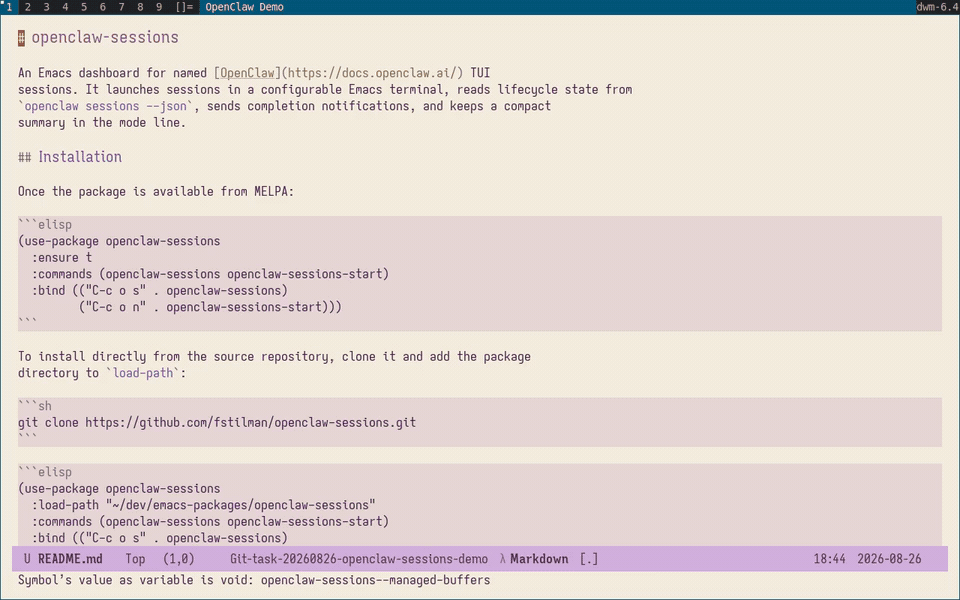

# openclaw-sessions

An Emacs dashboard for named [OpenClaw](https://docs.openclaw.ai/) TUI
sessions. It can turn the Org heading, mu4e message, region, or buffer at point
into a session with useful initial context. It launches sessions in a
configurable Emacs terminal, reads lifecycle state from `openclaw sessions
--json`, sends completion notifications, and keeps a compact summary in the
mode line.

## Demo

Create named sessions directly from the dashboard, monitor their lifecycle,
and see which completed sessions still need review:



## Installation

Once the package is available from MELPA:

```elisp
(use-package openclaw-sessions
  :ensure t
  :commands (openclaw-sessions openclaw-sessions-start
             openclaw-sessions-start-at-point)
  :bind (("C-c o s" . openclaw-sessions)
         ("C-c o n" . openclaw-sessions-start)
         ("C-c o ." . openclaw-sessions-start-at-point)))
```

To install directly from the source repository, clone it and add the package
directory to `load-path`:

```sh
git clone https://github.com/fstilman/openclaw-sessions.git
```

```elisp
(use-package openclaw-sessions
  :load-path "~/dev/emacs-packages/openclaw-sessions"
  :commands (openclaw-sessions openclaw-sessions-start
             openclaw-sessions-start-at-point)
  :bind (("C-c o s" . openclaw-sessions)
         ("C-c o n" . openclaw-sessions-start)
         ("C-c o ." . openclaw-sessions-start-at-point)))
```

The package requires Emacs 27.1 or newer and the `openclaw` executable. VTerm
and Eat are optional; the built-in Term backend requires no extra package.

## Usage

- `M-x openclaw-sessions-start` asks only for a session name and opens
  `openclaw tui --session NAME` in a dedicated terminal buffer.
- `M-x openclaw-sessions-start-at-point` creates or revisits a session for the
  semantic object at point and sends its context as the initial message.
- `M-x openclaw-sessions` opens the dashboard.
- `RET` visits or attaches to the selected session.
- `o` visits the Org heading, email, file, or buffer that created the selected
  contextual session.
- `D` forgets the selected source association without deleting its OpenClaw
  session; invoking the point command again will create a fresh association.
- `m` marks its latest completion as reviewed.
- `u` marks it as unreviewed again.
- `n` starts a session.
- `g` refreshes immediately.
- `s` cycles globally between package-managed, direct, and all sessions. The
  dashboard and mode-line indicator always use the same scope.
- `t` shows recent `openclaw sessions tail` output.
- `q` closes the dashboard window.

Use a prefix argument with `openclaw-sessions-start` to select an agent
explicitly. The prompt provides standard completion over the agents returned
by `openclaw agents list --json`, while still accepting a new agent ID. The
resulting target is `agent:AGENT:NAME`.

## Context-aware sessions

`openclaw-sessions-start-at-point` tries these providers in order:

1. An active region.
2. The current Org heading.
3. The mu4e message selected in headers or open in the message view.
4. A fallback around point in the current file or buffer.

The generated session name combines a readable slug with a short hash of the
source identity. Repeating the command on the same source reopens its session
without sending the initial message again. Associations are saved in
`openclaw-sessions-context-registry-file`; this also keeps contextual sessions
in the `managed` dashboard scope across Emacs restarts.

Use `C-u M-x openclaw-sessions-start-at-point` to edit the generated session
name, agent, and initial message. Customize
`openclaw-sessions-context-functions` to reorder providers or add one: each
function takes no arguments and returns an `openclaw-sessions-context` object,
or nil when it does not apply.

### Org

The Org provider uses an existing `ID` or `CUSTOM_ID` when available, but does
not create properties or otherwise modify the Org file. Without one, identity
comes from the file and outline path. The initial message includes the clean
heading title, TODO state, scheduling metadata, selected properties, and either
the heading or its whole subtree:

```elisp
(setq openclaw-sessions-org-context-scope 'subtree)
(setq openclaw-sessions-org-properties
      '("ID" "CUSTOM_ID" "EFFORT" "ASSIGNED_TO"))
```

Changing a heading's outline path changes its fallback identity. Add an Org
`ID` when a durable association matters.

### mu4e

The mu4e provider includes message headers, plain text, and attachment names;
it never includes attachment contents automatically. Quoted lines and
signatures are removed by default. Email text is delimited as untrusted source
material, and the default send policy asks for confirmation before sending it
to OpenClaw.

```elisp
(setq openclaw-sessions-mu4e-identity 'message) ; or 'thread
(setq openclaw-sessions-mu4e-strip-quoted-text t)
(setq openclaw-sessions-context-confirm-before-send 'email)
```

The `thread` identity uses mu4e's thread path when available, allowing related
messages to share one session.

### Context limits and privacy

Extracted source text is limited to 12,000 characters by default:

```elisp
(setq openclaw-sessions-context-max-characters 12000)
```

Initial context is passed to `openclaw tui --message`, so it is sent as soon as
the TUI connects. Set `openclaw-sessions-context-confirm-before-send` to
`always`, `email`, or `never` according to the desired confirmation policy.

## Working-directory semantics

The shell CWD is not the agent's working directory. OpenClaw sessions use the
workspace configured for their selected agent. The TUI only examines its CWD
to infer an agent when launched inside that agent's configured workspace.

Accordingly, this package does not use `project.el`, prompt for a directory, or
display directories in the dashboard. By default the TUI inherits the current
buffer's `default-directory`, preserving OpenClaw's native inference. Set a
fixed directory when deterministic selection is preferred:

```elisp
(setq openclaw-sessions-launch-directory "~/.openclaw/workspace")
```

Alternatively, set `openclaw-sessions-default-agent`; explicit agent selection
is clearer and does not depend on CWD:

```elisp
(setq openclaw-sessions-default-agent "main")
```

## Terminal backends

`openclaw-sessions-terminal-backend` controls where TUI sessions run. Its
default value, `auto`, selects VTerm, then Eat, then the built-in Term:

```elisp
(setq openclaw-sessions-terminal-backend 'auto)  ; vterm → eat → term
(setq openclaw-sessions-terminal-backend 'eat)   ; require Eat
(setq openclaw-sessions-terminal-backend 'term)  ; no optional dependency
```

Each built-in backend runs the OpenClaw executable directly. Eat and Term pass
its argument vector unchanged; VTerm receives an equivalently shell-quoted
command because that is the interface exposed by VTerm.

For another Emacs terminal integration, set the option to a function. It
receives `SESSION-NAME`, `EXECUTABLE`, `ARGUMENTS`, and `DIRECTORY`, and must
return the live terminal buffer:

```elisp
(defun my-openclaw-terminal (session-name executable arguments directory)
  ;; Create the terminal and start EXECUTABLE with ARGUMENTS in DIRECTORY.
  ;; Return its Emacs buffer.
  )

(setq openclaw-sessions-terminal-backend #'my-openclaw-terminal)
```

Returning a buffer preserves session tracking, `RET` navigation, and the
`managed` scope. Line-oriented `shell-mode` and plain Eshell are not supported
because `openclaw tui` requires terminal emulation. Eat's Eshell visual-command
integration can still be used through a custom launcher.

See the OpenClaw documentation for [TUI selection](https://docs.openclaw.ai/cli/tui),
[agent workspaces](https://docs.openclaw.ai/concepts/agent-workspace), and
[session worktrees](https://docs.openclaw.ai/concepts/managed-worktrees).

## Monitoring

Refreshes are asynchronous and never block Emacs. The default interval is ten
seconds because starting the OpenClaw CLI has non-trivial overhead. Customize
`openclaw-sessions-refresh-interval`, or set it to nil for manual refresh only.

The default dashboard scope includes only sessions launched or attached by the
package. Press `s` to inspect other recent OpenClaw sessions.

When a direct session changes from `RUNNING` to a terminal status, the
dashboard shows `●` in its **New** column. The marker means that the completion
has not yet been reviewed; it is not inferred from buffer visibility. Visiting
the session buffer—whether through `RET`, `switch-to-buffer`, Ibuffer, or a
completion UI—or viewing its tail with `t` clears it. Merely displaying the
buffer without selecting it does not. The `m` and `u` commands allow explicit
control. Existing completed sessions are not marked when monitoring starts:
only transitions observed by Emacs count as new.

Custom mode lines can include the public `openclaw-sessions-mode-line`
construct directly. It displays running (`▶`), successful (`✓`), and failed
(`!`) session counts, plus unreviewed completions (`●`), for
`openclaw-sessions-dashboard-scope`. Customize
`openclaw-sessions-mode-line-prefix` to change its left spacing.

## Tests

```sh
emacs -Q --batch \
  -L . -L test \
  -l test/openclaw-sessions-test.el \
  -f ert-run-tests-batch-and-exit
```

Run every local check with:

```sh
make test compile checkdoc package-lint
```

`package-lint` must be installed separately from MELPA.

## License

GNU General Public License version 3 or later. See [LICENSE](LICENSE).
